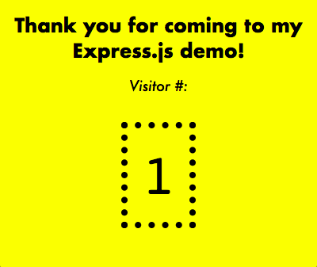

# express-demo-presentation

>A small application to demonstrate the Express.js web framework for Node.js

This app is written for a presentation reviewing key concepts around using Express. For the benefit of the presentation, nearly everything is written in a single file: `server/app.js` 

To try it out, you'll need Node.js and the npm package manager. To start the app:

- Run `npm install` in the project directory to install dependencies
- Run `node project/app.js`, the tool [nodemon](https://www.npmjs.com/package/nodemon) is also reccomended as an alternative to node to automatically restart the server as you play around with the code and save changes. 
- Visit the server in-browser at `http://localhost:8000` or use a tool like [Postman](https://www.getpostman.com/) or [cURL](https://github.com/curl/curl) to practice receiving, responding and logging data with the server's api endpoints.